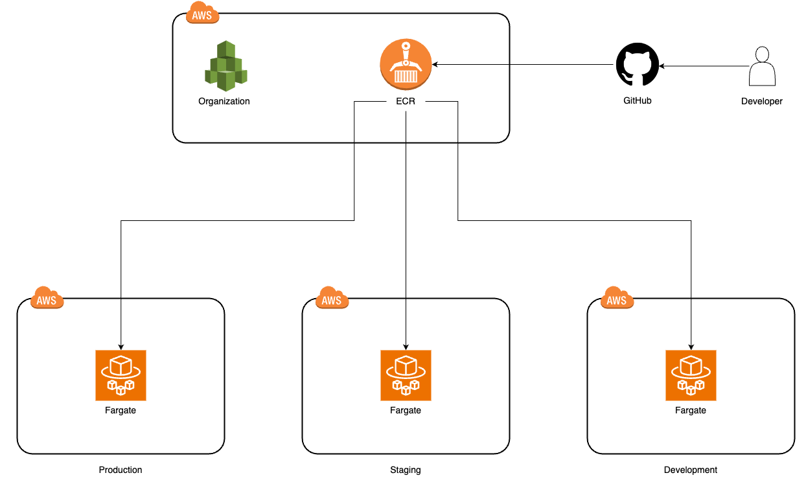
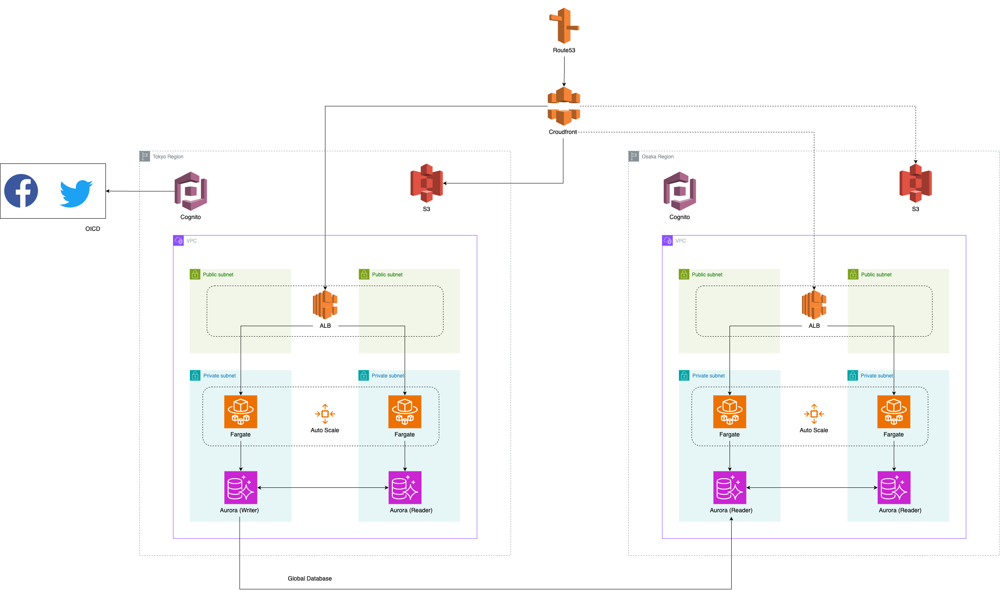

# インフラ構成図

- GitHubActionでCI/CDを実行します。
- ECRリポジトリを親アカウントに配置し、テスト済みのイメージを本番で使用します。
- エンジニアの権限管理を厳密に行うために、AWS Organization で開発・検証・本番環境を分離させます。

- ユーザー認証にはCognitoを利用します。
- Fargateでホスティングされているアプリケーションログは CloudWatch -> サブスクリプションフィルター -> S3 に保存する。もしくはFluentBitのコンテナをサイドカーパターンで起動し、ログをS3に送信する。アプリケーションのコンテナの中にはログは残さない。
- メール機能は AWS SES を使用する。
- メールマガジン配信は Fargate と EventBridge を使用して ShceduledTask を構築し、任意のユーザーにメルマガを送信する。
- Fargate、Auroraでオートスケールを設定する。
- ALBの全面に配置したCloudFrontで可能な限りのキャッシュする
- 必要があれば Elastic Cache(Redis)を作成し、クエリ結果などのキャッシュを行う。
- SNS Platform Applicationでプッシュ通知の送信を行う。
- 必要であればディザスタリカバリを考慮する。
- 複数のリージョンですぐにアプリケーションを動かせるようにパイロットライトにて構築する。
- データベースのデータやCognitoに保存された情報などは常に別リージョンにクローンする。難しいものはサードパーティーサービスを利用する。
